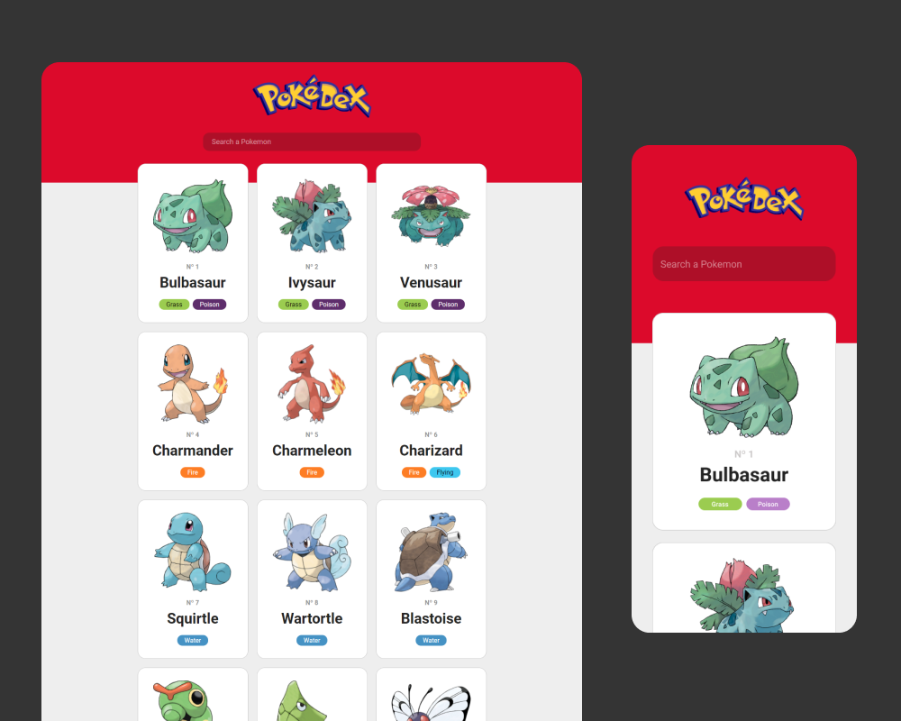

# Pokédex

Esse foi um projeto pessoal para treinar formas de consumir uma API, consumi tanto a API para buscar as informações de cada Pokémon, quanto uma para buscar as imagens. Por fim, temos todos os Pokémons da primeira geração :).

## :sparkles: Layout

Feito por mim no Figma :D

## :rocket: Tecnologias usadas

* HTML
* CSS
* JavaScript
    * Fetch API
* Figma

## :computer: Site

* [Só clicar aqui :D](https://felipinas.github.io/pokedex/)